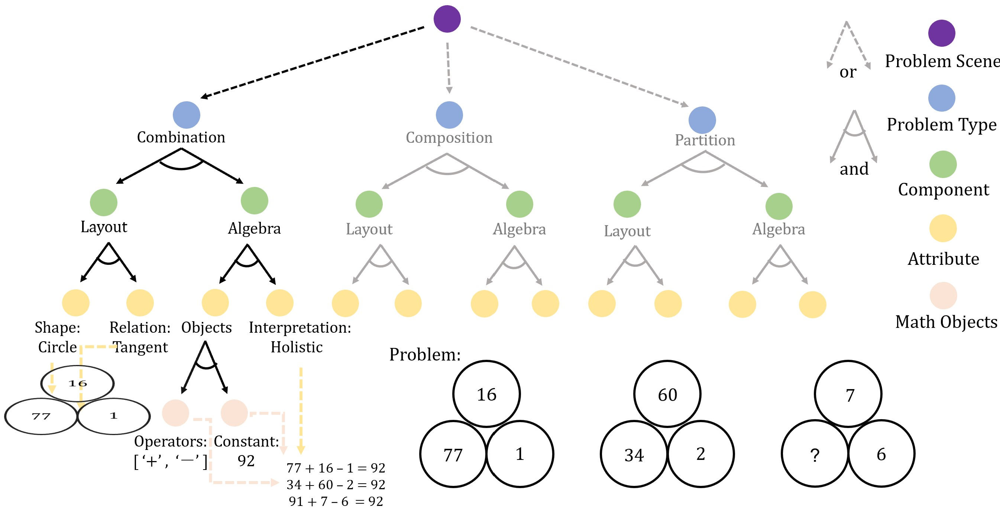

# Machine Number Sense
PyTorch implementation of neural networks for solving problems from the Machine Number Sense (MNS) dataset [[1]](#1).
Dataset and official implementation of baseline models can be found in [this repo](https://github.com/zwh1999anne/Machine-Number-Sense-Dataset), created by paper authors.

## Setup
```bash
$ pip install machine_number_sense
```

## Usage

### Baseline models
MLP [[1]](#1):
```python
import torch

from mns.model import ConvMLP

x = torch.rand(4, 3, 80, 80)
mlp = ConvMLP(image_size=80)
logits = mlp(x)
logits  # torch.Tensor with shape (4, 99)
```

LSTM [[1]](#1):
```python
import torch

from mns.model import ConvLSTM

x = torch.rand(4, 3, 80, 80)
lstm = ConvLSTM(image_size=80)
logits = lstm(x)
logits  # torch.Tensor with shape (4, 99)
```

### Experimental models
Scattering Compositional Learner (SCL) [[2]](#2) adapted to problems from the MNS dataset:
```python
import torch

from mns.model import SCL

x = torch.rand(4, 3, 80, 80)
scl = SCL(image_size=80)
logits = scl(x)
logits  # torch.Tensor with shape (4, 99)
```
> Implementation of SCL for solving Raven's Progressive Matrices can be found in [this repo](https://github.com/mikomel/scattering-compositional-learner). 

Neural Arithmetic Logic Unit (NALU) [[3]](#3) adapted to MNS:
```python
import torch

from mns.model import ConvNALU

x = torch.rand(4, 3, 80, 80)
nalu = ConvNALU(image_size=80)
logits = nalu(x)
logits  # torch.Tensor with shape (4, 99)
```

### Dataset
The MNS dataset can be obtained as described [in this repo](https://github.com/zwh1999anne/Machine-Number-Sense-Dataset).
After downloading, it can be loaded with:
```python
from mns.dataset import MNSDataset

dataset = MNSDataset(data_dir='/path/to/dataset', image_size=80)
iterator = iter(dataset)
image, target = next(iterator)
image  # torch.Tensor with shape (3, 80, 80)
target  # torch.Tensor with shape ()
```

### Training
File `mns.module` contains a [PyTorch Lightning](https://github.com/PyTorchLightning/pytorch-lightning) module for training models on MNS.
Training can be run with Docker using scripts from the `scripts/` directory.

## Unit tests
```bash
$ python -m pytest tests
```

## Bibliography
<a id="1">[1]</a> Zhang, Wenhe, et al. "Machine number sense: A dataset of visual arithmetic problems for abstract and relational reasoning." Proceedings of the AAAI Conference on Artificial Intelligence. 2020.

<a id="2">[2]</a> Wu, Yuhuai, et al. "The Scattering Compositional Learner: Discovering Objects, Attributes, Relationships in Analogical Reasoning." arXiv preprint arXiv:2007.04212 (2020).

<a id="3">[3]</a> Trask, Andrew, et al. "Neural arithmetic logic units." Advances in Neural Information Processing Systems. 2018.

## Citations
```bibtex
@inproceedings{zhang2020machine,
  title={Machine number sense: A dataset of visual arithmetic problems for abstract and relational reasoning},
  author={Zhang, Wenhe and Zhang, Chi and Zhu, Yixin and Zhu, Song-Chun},
  booktitle={Proceedings of the AAAI Conference on Artificial Intelligence},
  volume={34},
  number={02},
  pages={1332--1340},
  year={2020}
}
```

```bibtex
@article{wu2020scattering,
  title={The Scattering Compositional Learner: Discovering Objects, Attributes, Relationships in Analogical Reasoning},
  author={Wu, Yuhuai and Dong, Honghua and Grosse, Roger and Ba, Jimmy},
  journal={arXiv preprint arXiv:2007.04212},
  year={2020}
}
```

```bibtex
@inproceedings{trask2018neural,
  title={Neural arithmetic logic units},
  author={Trask, Andrew and Hill, Felix and Reed, Scott E and Rae, Jack and Dyer, Chris and Blunsom, Phil},
  booktitle={Advances in Neural Information Processing Systems},
  pages={8035--8044},
  year={2018}
}
```
